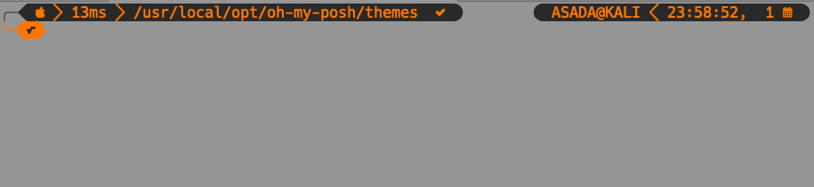
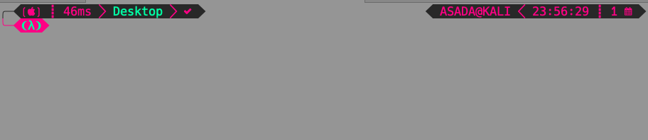
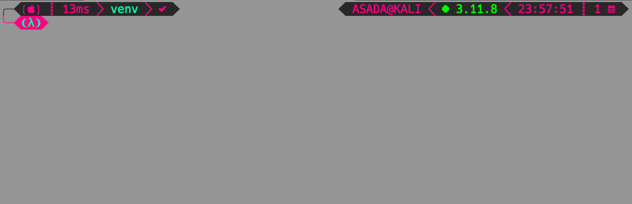

# My oh-my-posh-theme (windows later)
## lambdarework is a child of the [lambdageneration](https://github.com/JanDeDobbeleer/oh-my-posh/blob/main/themes/lambdageneration.omp.json) theme.

## lambdarework: 

## Includes a python venv version at the right of the promt

## download [oh-my-posh](https://ohmyposh.dev/)
## download [fonts](https://www.nerdfonts.com/)